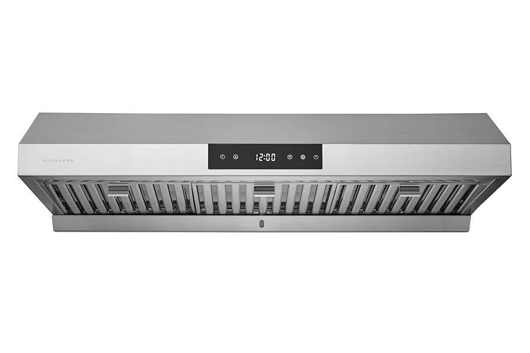
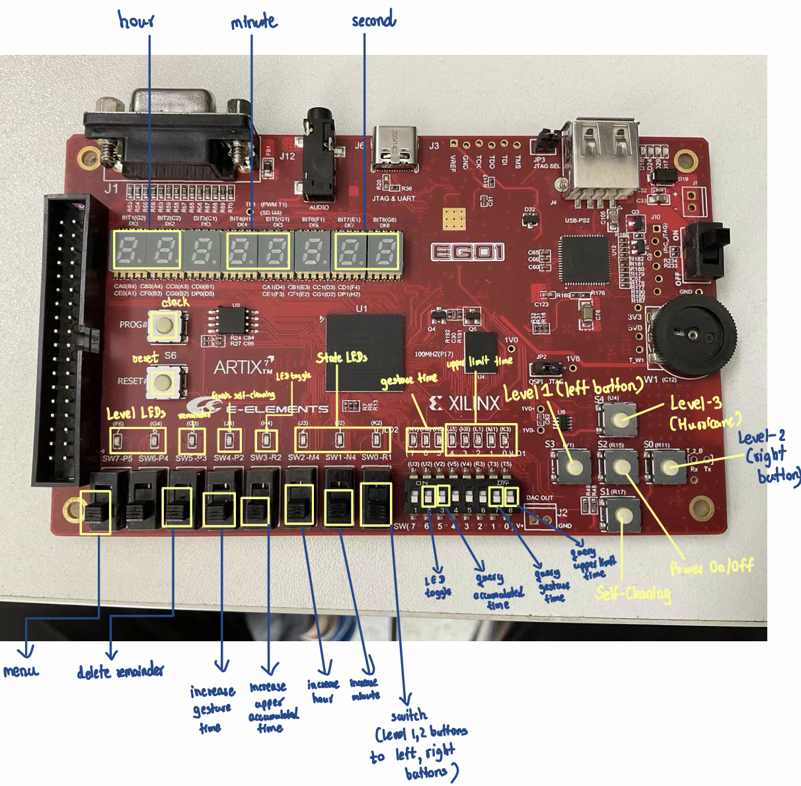

# Control Circuit of Kitchen Exhaust Hood

#### CS202: Digital Logic Project

#### Project Requirements => [Detailed Project Requirements](./documents/digital_logic_2024f_projects_introduction_English.pdf)

#### Description

- The kitchen exhaust hood has two states: power on and power-off. In the power-on state, it offers three operating modes: standby mode, extraction mode, and self-cleaning mode. In extraction mode, there are three levels: Level 1, Level 2, and Level 3 (hurricane mode). The kitchen exhaust hood uses the self-cleaning mode to clean itself and provides a cleaning reminder after prolonged or frequent use. When powered on, users can toggle the lighting function on or off at any time, and the hood continuously displays the time. In standby mode, the hood can enter either extraction mode or self-cleaning mode, and users can manually set the time. Through settings, users can enable a special gesture control to power the hood on and off within a specified time.

#### Features

1. **Parameters**

   1. **Factory Settings**: All times mentioned in the following descriptions (the 10 hour accumulated working time related to the cleaning smart reminder, the 3-minute self-cleaning operation time, the 60-second countdown in hurricane mode, and the 5-second valid time for the power-on/off gesture simulation) are set as factory defaults.
   2. Individual parameters can be set through the advanced settings function (refer to the "Advanced Settings" item in the "Auxiliary Functions" section).
   3. The circuit supports restoring these parameters to their factory default values by pressing the "**Restore Factory Settings**" button.

2. **Power on/off**

   1. **Power on**: Short press the **power button** to turn on the kitchen exhaust hood. After powering on, the hood will complete initialization. a) Initialization of the kitchen exhaust hood: The current time will be 0 hours, 0 minutes, and 0 seconds. If you query the accumulated usage time of the kitchen exhaust hood, the result will be 0.
   2. **Power off**: Long press the **power button** for **3 seconds** to turn off the kitchen exhaust hood. After power off, all buttons will be disabled.
   3. Simulate gesture control using buttons to power on/off
      - First, press the **left button** to start a **5-second countdown**. Press the right button within the 5 seconds to power on.
      - First, press the **right button** to start a **5-second countdown**. Press the **left button** within the 5 seconds to **power off**.
      - If the second button press is not completed within the 5-second countdown, the operation will be considered invalid (e.g., if the left button is pressed but the right button is not pressed within 5 seconds, the power-on operation will fail).

3. **Mode Switching**

   1. After the kitchen exhaust hood is powered on, it enters standby mode. In standby mode, press the menu button to prepare for mode switching, and then press different buttons to enter different modes (extraction mode: Level 1, Level 2, Level 3; self-cleaning mode). For example, in standby mode, press the menu button first, then press the Level 1 button to enter the extraction mode at Level 1.

   2. Returning to standby mode from different working modes:

      - The extraction modes at Level 1 and Level 2 can return to standby mode directly by pressing the **menu button**.

      - The extraction mode at Level 3 will start a 60-second countdown after pressing the menu button, and it will return to standby mode after the countdown expires.

      - The self-cleaning mode will start a 3-minute countdown after it begins operating, and it will return to standby mode after the countdown expires.

4. **Extraction Function**

   1. In standby mode, press the **menu button** to enter mode switching, then press the **speed level button** (Level 1, Level 2, Level 3) to enter different fan speed levels in extraction mode.
   2. When entering any extraction mode, the accumulated working time starts. When exiting the extraction mode, the timer stops and stores the cumulative working time of the hood after being powered on. This time will be used for the smart reminder function related to self-cleaning.
   3. **Level 1**: Press the **Level 1 button** to set the kitchen exhaust hood to Level 1 speed. Press the menu button to switch back to standby mode.
   4. **Level 2** : Press the **Level 2 button** to set the kitchen exhaust hood to Level 2 speed. Press the menu button to switch back to standby mode.
   5. In both Level 1 and Level 2 extraction modes, you can switch between the levels by pressing the corresponding speed buttons.
   6. **Level 3 (Hurricane Mode)**: Press the **Level 3 button** to set the kitchen exhaust hood to Level 3 speed.
      - Hurricane mode can only be used once after each power-on. If the Level 3 button is pressed multiple times, only the first press will be effective; subsequent presses will be ignored.
      - Pressing the Level 3 button will set the kitchen exhaust hood to Level 3 (Hurricane mode) and start a 60-second countdown for hurricane mode. After the countdown ends, it will automatically switch to Level 2 mode to continue operation.
      - If the 60-second countdown in Hurricane mode has not finished, pressing the menu button to force standby will start a 60-second countdown to return to standby mode. Once the countdown ends, the system will automatically enter standby mode.

5. **Self-Cleaning Function**

   1. The self-cleaning mode can only be accessed from standby mode.
   2. In standby mode, press the **menu button**, then press the **self-cleaning** button to enter self-cleaning mode. A 3-minute countdown will begin. Once the countdown ends, a reminder will notify that the self-cleaning is complete, and the system will automaticaly return to standby mode.

6. **Auxiliary Functions**

   1. **Lighting Function**: The lighting function can be turned on or off in any mode after powering on.
   2. **Time Function**:
      - Time Display: After powering on, the current time (hours, minutes, seconds) is dynamically displayed.
      - Time Setting: In standby mode, the time can be adjusted by entering the hour and minute settings.
   3. **Smart Reminder**: In extraction mode, the accumulated working time of the kitchen exhaust hood is tracked. When the accumulated time reaches a specified value (default is 10 hours), in standby mode, the hood will remind the user via an output device to perform manual cleaning or activate self cleaning. After each self-cleaning session, the accumulated working time of the hood is reset to zero. After manual cleaning, the user can reset the accumulated time using the manual switch.
   4. **Advanced Settings**: In standby mode, certain parameters can be reconfigured.
      1. Set the upper limit for the usage duration that triggers the smart reminder. This setting will take effect once configured; if not set, the factory default value will be used.
      2. Set the valid time for gesture control (in seconds). For example, the default is 5 seconds, but the user can adjust it to 7 seconds (longer) or 2 seconds (shorter).
   5. **Query Function**: In standby mode, users can query the following:
      1. The accumulated working time in extraction mode.
      2. The valid time for gesture control.

#### System usage instructions

#### Input:

- **sw7-p5**: menu button

- **sw6-u2**: led toggle

- **sw5-p3**: delete reminder button

- **sw4-p2**: increase gesture time

- **sw3-r2:** increase upper accumulated time

- **sw2-m4**: increase hour

- **sw1-n4**: increase minute

- **sw0-r1**: switch for level button or the bonus part button

- **sw5-v2**: query accumulated time

- **sw1-t3**: query gesture time

- **sw0-t5**: query upper limt time

- **S0**: level2 & right button for bonus

- **S1**: cleaning mode button

- **S2**: power on/off button

- **S3**: level1 & left button for bonus

- **S4**: hurricane mode button

#### **Output:**

- **F6, G4**: level LEDs
- **G3**: reminder
- **J4**: self cleaning
- **H4**: led toggle
- **J3, J2, K2**: state LEDs
- **K1, H6, H5**: gesture time
- **J5, K6, L1, M1, K3**: upper limit time
- **7-Segment Display**: time displaying (hr, min, second)

## System structure description

The top_kitchen_hood_controller is the highest of all the module, and under top module, there are lighting_controller, mode_controller, power_controller, segment_display_controller, time_controller. And the button_debouncer_controller is used for debounce of the button.

## Top Module

#### Input

- **clk**: System clock signal for synchronization.
- **rst_n_raw**: Raw reset signal (active low).
- **power_btn_raw**: Raw input from the power button.
- **menu_btn**: Input for the menu button. level1_btn_raw:
- **level1_btn_raw**: Raw input for level 1 extraction.
- **level2_btn_raw**: Raw input for level 2 extraction.
- **level3_btn_raw**: Raw input for level 3 extraction.
- **self_clean_btn_raw**: Raw input for self-cleaning mode.
- **power_left_right_control**: Control signal for power direction.
- **manual_reset_btn**: Input for a manual reset.
- **hour_increment**: Signal to increment the hour.
- **minute_increment**: Signal to increment the minute.
- **query_upper_accumulated_time_switch**: Switch for querying upper accumulated time.
- **upper_hour_increase_switch**: Switch for increasing upper hours.
- **increase_gesture_time**: Signal to increase gesture time.
- **query_gesture_time**: Signal to query gesture time.
- **lighting_switch**: Control signal for lighting.
- **query_accumulated_time_switch**: Switch for querying accumulated time.

#### Output

- **query_leds**: Output for LED indicators related to queries.
- **query_gesture_time_value**: Output for the current gesture time value.
- **current_mode**: Indicates the current operational mode.
- **extraction_level**: Indicates the current extraction level.
- **cleaning_active**: Indicates if the self-cleaning mode is active.
- **reminder_led**: Output for the reminder LED.
- **seg_en**: 7-segment display enable signals.
- **seg_out0**: 7-segment display output for the first display.
- **seg_out1**: 7-segment display output for the second display.
- **lighting_state**: Indicates the current state of the lighting.

**The sub module contain 6 parts.**

## 1. lighting_controller

#### Input

- **clk**: Clock signal used to drive state updates.
- **rst_n**: Active low reset signal. The system resets when this signal is low.
- **power_state**: Power state signal indicating whether the system power is on.
- **lighting_switch**: Lighting switch input signal used to control the lighting state.

#### Output

- **lighting_state**: Output signal for the lighting state, indicating whether the lighting is on or off.

## 2. mode_controller

#### Input

- **clk**: Clock signal used to drive state updates.
- **rst_n**: Active low reset signal. The system resets when this signal is low.
- **power_state**: Power state signal indicating whether the system power is on.
- **menu_btn**: Input for the menu button.
- **level1_btn**: Input for the level 1 button.
- **level2_btn** Description: Input for the level 2 button.
- **level3_btn**: Input for the level 3 button.
- **self_clean_btn**: Input for the self-cleaning button.
- **manual_reset_btn**: Input for the manual reset button.
- **query_upper_accumulated_time_switch**: Switch for querying upper accumulated time.
- **upper_hour_increase_switch** Description: Switch for increasing hours.
- **power_left_right_control**: Input for left/right power control.
- **query_accumulated_time_switch**: Input for querying accumulated time.

#### Output

- **accumulated_seconds**: Output for accumulated seconds.
- **display_accumulated_time**: Output for displaying accumulated time.
- **query_leds**: Output for query LEDs.
- **current_mode**: Output for the current mode.
- **extraction_level**: Output for extraction level.
- **countdown_seconds**: Output for countdown seconds.
- **cleaning_active**: Output for cleaning active status.
- **reminder_led**: Output for reminder LED.
- **display_countdown**: Output for displaying countdown.

## 3. power_controller

#### Input

- **clk**: Clock signal used for synchronization.
- **rst_n**: Active low reset signal. The system resets when this signal is low.

- **power_btn_raw**: Raw input from the power button.
- **power_left_right_control**: Control signal for left/right power gestures.
- **level1_btn_raw**: Raw input from the level 1 button.
- **level2_btn_raw**: Raw input from the level 2 button.
- **increase_gesture_time**: Signal to increase gesture duration.
- **query_gesture_time**: Signal to query the current gesture time.

#### Output

- **power_state**: Output indicating the current power state (on/off).

- **gesture_countdown**: Output for the countdown timer for gestures.

- **display_gesture_countdown**: Output for displaying the gesture countdown status.

- **query_gesture_time_value**: Output for the queried gesture time value.

## 4.segment_display_controller

#### Input

- **clk**: Clock signal for synchronization.
- **rst_n**: Active low reset signal. The module resets when this signal is low.
- **hours**: Input representing hours (0-23). minutes: Input representing minutes (0-59).
- **seconds**: Input representing seconds (0-59).
- **display_countdown**: Control signal to indicate if countdown should be displayed.
- **countdown_seconds**: Input for countdown seconds.
- **gesture_countdown**: Input for gesture countdown.
- **display_gesture_countdown**: Control signal to indicate if gesture countdown shouldb e displayed.
- **accumulated_seconds**: Input for accumulated seconds.
- **display_accumulated_time**: Control signal to indicate if accumulated time should be displayed.
- **power_state**: Signal indicating if the power is on (1) or off (0).

#### Output

- seg_en: Segment enable signals for controlling which segments are active.

- seg_out0: Segment output for the first display.

- seg_out1: Segment output for the second display.

## 5.time_controller

### Input

- **clk**: Clock input used for timing and synchronization.
- **rst_n**: Active-low reset signal; when low, the module resets its internal states.
- **power_state**: Indicates whether the device is powered on (1) or off (0).
- **hour_increment**: Signal to increment the hour.minute_increment: Signal to increment the minute.
- **current_mode**: Represents the current operational mode (e.g., standby mode).

### Output

- **hours**: Output for hours (0-23).

- **minutes**: Output for minutes (0-59).

- **seconds**: Output for seconds (0-59).

## 6.button_debouncer_controller

### Input

- **clk**: Clock input used for synchronization.
- **btn_in**: Input signal from the button that needs to be debounced.

### Output

- **btn_out**: Debounced output signal that reflects the stable state of the button.

### Contribution

| Contributor  | Circuit Implementation(in Verilog) | Report |
| :----------: | :--------------------------------: | :----: |
| Wai Yan Kyaw |                 ✔️                 |   ✔️   |
| Sean Sovann  |                 ✔️                 |   ✔️   |
|    莫丰源    |                 ✔️                 |   ✔️   |
